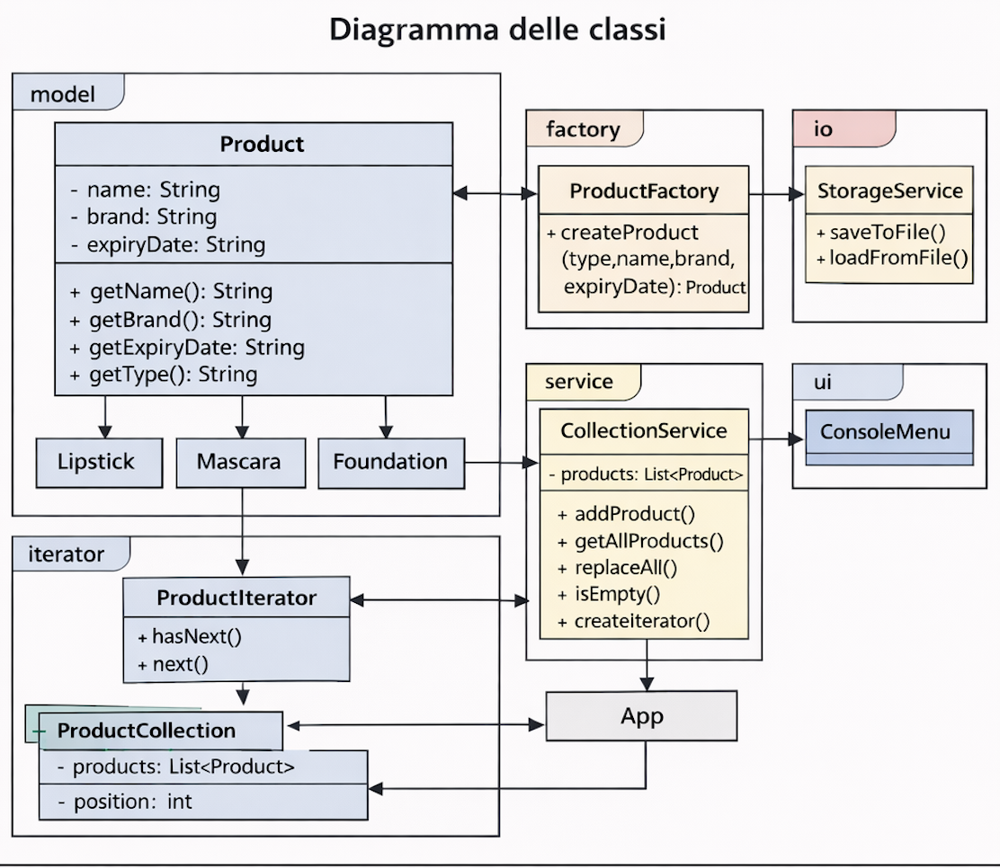
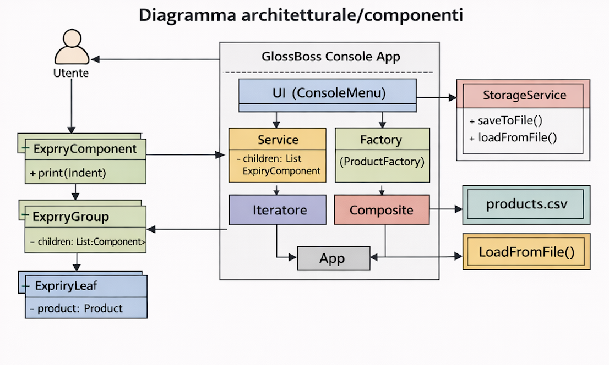

# GlossBoss – Makeup Organizer (Applicazione Java da Console)

GlossBoss è un’applicazione Java da linea di comando che ho sviluppato come progetto universitario.
Lo scopo del progetto è gestire una collezione personale di prodotti make-up (come lipstick, mascara e foundation), salvandoli su file e permettendo di visualizzare in modo ordinato le date di scadenza.

Durante lo sviluppo ho organizzando le classi in package separati in base alle responsabilità e applicando alcuni design
pattern studiati durante il corso.

---

## Panoramica dell’applicazione e funzionalità

All’avvio dell’applicazione viene mostrato un menu testuale che permette di:

- aggiungere un prodotto specificando tipo, nome, brand e data di scadenza
- visualizzare tutti i prodotti inseriti
- salvare la collezione su file CSV
- caricare la collezione da file
- visualizzare i prodotti raggruppati per mese di scadenza
- registrare le operazioni principali in un file di log

Il programma continua a funzionare finché l’utente non sceglie di uscire.

---

## Tecnologie utilizzate

Per questo progetto ho utilizzato:

- Java 17  
- Maven per la gestione del progetto e l’esecuzione dei test  
- java.util.logging per il logging  
- File CSV per la persistenza dei dati  
- Scanner per la lettura dell’input da console  
- JUnit per i test automatici  

---

## Struttura del progetto

Di seguito è riportata la struttura principale delle cartelle e dei file:

```
glossboss/
├── pom.xml
├── README.md
├── data/
│   └── products.csv
├── logs/
│   ├── glossboss.log
│   └── glossboss.log.lck
├── docs/
│   ├──diagrammi_esame_OOP.png
└── src/
    ├── main/java/it/valentinamanduci/glossboss/
    │   ├── App.java
    │   ├── model/
    │   │   ├── Product.java
    │   │   ├── Lipstick.java
    │   │   ├── Mascara.java
    │   │   └── Foundation.java
    │   ├── factory/
    │   │   └── ProductFactory.java
    │   ├── service/
    │   │   └── CollectionService.java
    │   ├── io/
    │   │   └── StorageService.java
    │   ├── iterator/
    │   │   ├── ProductIterator.java
    │   │   ├── ProductCollection.java
    │   │   └── GlossBossIterator.java
    │   ├── composite/
    │   │   ├── ExpiryComponent.java
    │   │   ├── ExpiryGroup.java
    │   │   └── ExpiryLeaf.java
    │   ├── ui/
    │   │   └── ConsoleMenu.java
    │   └── util/
    │       └── LogConfig.java
    └── test/java/it/valentinamanduci/glossboss/
        └── ProductFactoryTest.java
```

---

## Avvio ed esecuzione

### Esecuzione dei test
```
mvn test
```

## Test automatici

Sono stati implementati test JUnit per verificare la corretta creazione dei
prodotti tramite la factory e il funzionamento dei servizi principali.

I test si trovano in:

src/test/java/it/valentinamanduci/glossboss/

### Avvio dell’applicazione
```
mvn exec:java -Dexec.mainClass="it.valentinamanduci.glossboss.App"
```

---

## Formato dei dati salvati

I prodotti vengono salvati nel file:

```
data/products.csv
```

Ogni riga segue il formato:

```
type|name|brand|expiryDate
```

Esempio:

```
lipstick|Ruby Woo|MAC|2026-02-10
```

---

## Design pattern utilizzati

### Factory Pattern
La classe ProductFactory centralizza la creazione dei prodotti in base al tipo inserito dall’utente. In questo modo la UI non deve conoscere le classi concrete e il codice risulta più modulare.

### Iterator Pattern
Un iteratore personalizzato permette di scorrere la collezione di prodotti senza
esporre direttamente la struttura dati interna.

### Composite Pattern
Il Composite Pattern viene usato per organizzare i prodotti in una struttura
gerarchica basata sulle date di scadenza: i gruppi rappresentano i mesi, mentre le
foglie rappresentano i singoli prodotti.

### Service Layer
CollectionService e StorageService separano la logica applicativa dalla UI e dalla
gestione dei file.

### Gestione delle eccezioni (Exception Shielding)
Gli errori di input o di file vengono gestiti mostrando messaggi semplici all’utente
senza interrompere l’esecuzione del programma.

---

## Logging

Le operazioni principali vengono salvate nel file:

```
logs/glossboss.log
```

Il file glossboss.log.lck è un file temporaneo creato automaticamente dal sistema di
logging per evitare accessi simultanei.

---

## UML

Il progetto include due diagrammi UML, inseriti nella cartella `docs/`.

### Diagramma delle classi
Rappresenta le principali classi del dominio (`Product`, `Lipstick`, `Mascara`,
`Foundation`), i servizi, la factory e i pattern Iterator e Composite.



### Diagramma architetturale / componenti
Mostra la suddivisione in package (ui, service, model, factory, io, iterator,
composite) e le dipendenze principali tra i livelli dell’applicazione.



---

## Limitazioni attuali

- Persistenza su file CSV semplice (non è un database).
- Validazione delle date minima.
- Possibilità di inserire prodotti duplicati.
- Interfaccia solo testuale.

---

## Possibili sviluppi futuri

- Aggiungere modifica e rimozione prodotti.
- Implementare ricerca e filtri.
- Ordinare le scadenze in modo cronologico.
- Salvare i dati in formato JSON o database.
- Aggiungere un’interfaccia grafica.

---

## Autrice

Valentina Manduci
